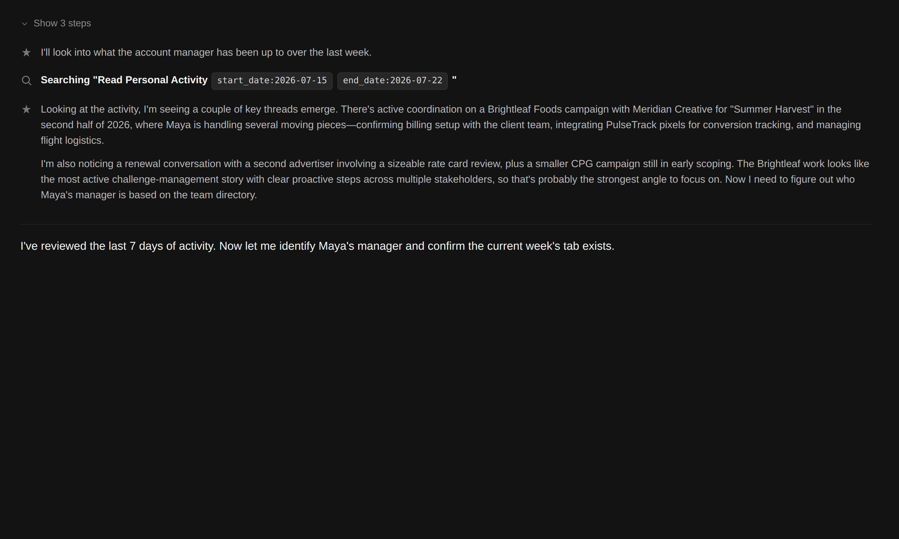
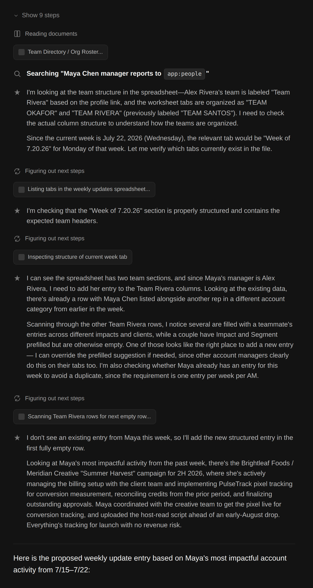
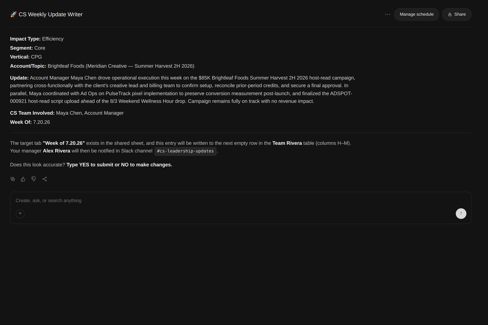
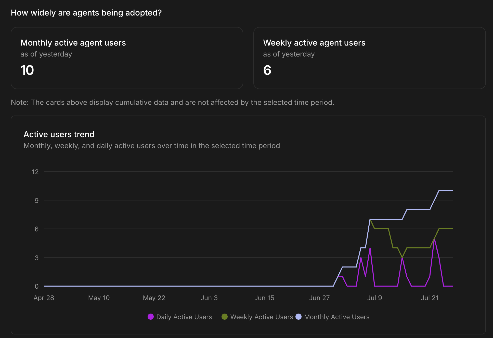
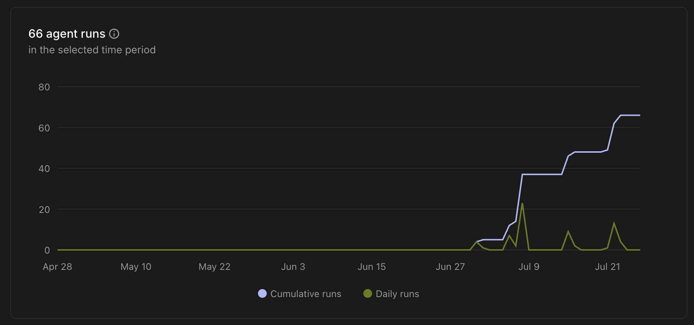
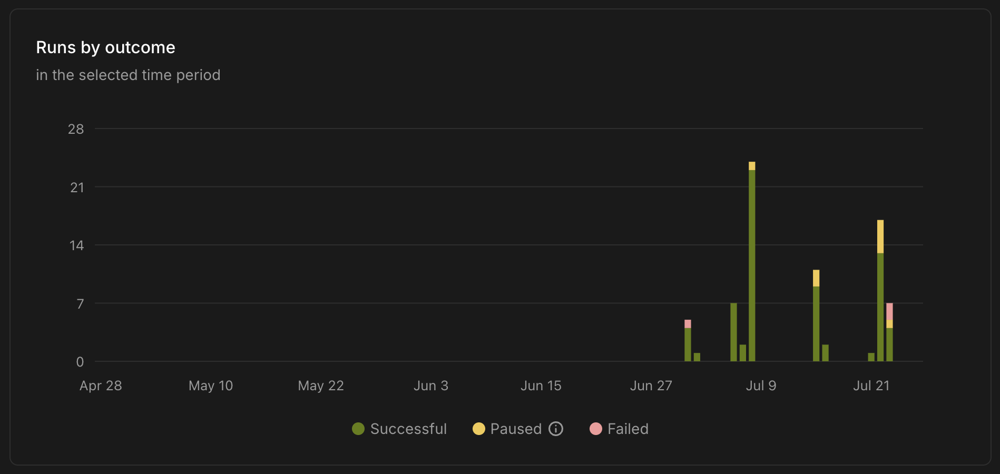
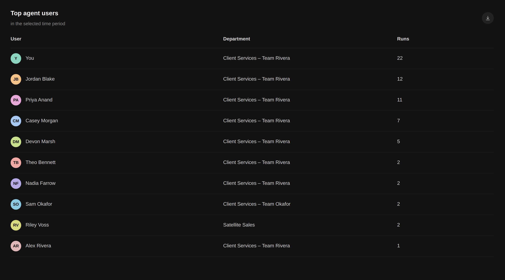

# Client Services Weekly Update Writer

*A Glean agent built to fix a quiet, easy-to-underestimate problem: leadership couldn't see the team's wins because writing them up was just annoying enough that people didn't.*

> Company names, client names, employee names, and other identifying details below — including in the screenshots — have been redacted, genericized, or replaced with fictional placeholders to protect confidential information. The underlying logic, flow, and results are real.

---

## The Problem

Account Managers were expected to send a weekly update to Client Services leadership — a short summary of what they'd accomplished that week, so leadership had visibility into account health, wins, and risks across the team. In practice, engagement was low. Writing the update meant stopping to reconstruct the week from memory, figuring out how to phrase it for a leadership audience, and finding the right spot in a shared tracking sheet to put it. None of that was hard, exactly — it was just enough friction that it kept slipping.

A manager noticed the pattern and asked if there was a way to help. That's the actual origin of this agent: not "let's build an AI tool," but a specific manager, a specific engagement problem, and a request to go solve it.

## What "Done" Had to Look Like

- **It had to run on its own schedule**, not wait for an AM to remember to open it — the whole problem was that remembering was the failure point.
- **It had to do the reconstruction work**, not just provide a blank template — pulling the week's activity together was the tedious part, not the writing.
- **Nothing goes to leadership without the AM's sign-off.** Automating the busywork is one thing; automating what gets said about a client relationship to the C-suite without a human checking it first is a different, much riskier thing.
- **It had to close the loop itself** — writing the entry and looping in the manager, so submitting an update stopped being a two-step chore (write it, then remember to flag it) and became one.

## Walking Through the Experience

**It starts on a schedule**, visible in the agent's own "Manage schedule" control — the AM doesn't have to initiate anything. When it runs, the agent searches the AM's activity from the past 7 days across Slack, email, and connected documents, and picks the single most impactful thing to write about — prioritized in order: revenue won or at risk, an actively managed challenge, an efficiency win, then a relationship highlight. That priority order matters more than it looks: it's what keeps leadership's weekly scan readable across a whole team instead of turning into ten people's stream-of-consciousness.

*The agent pulls the week's activity together on its own, rather than handing the AM a blank form to fill out from memory*

**Behind the scenes, it also has to figure out where the update belongs.** Every AM reports to a different manager, and the shared tracking sheet has a separate table per manager on a tab per week. The agent looks the AM up in the People directory, resolves their manager, and finds that manager's table on the current week's tab — the exact lookup an AM would otherwise have to do by hand every single week, and the exact kind of small friction that made people stop bothering.

*Manager lookup and tab/table routing happen automatically instead of requiring the AM to know the sheet's structure*

**Then it drafts the entry and stops.** The structured write-up — impact type, segment, vertical, account, a leadership-ready paragraph, and the week — gets shown to the AM with one explicit question: *does this look accurate, yes or no?* Nothing gets written anywhere until the AM confirms. That gate exists because this content is revenue-adjacent and headed straight to leadership — the automation should remove the busywork, not the AM's ownership of what gets said about their own account.

*The AM reviews and approves before anything is written — the agent drafts, it doesn't decide*

**Once approved, it writes and notifies in the same motion** — the entry lands in the correct row of the correct table, and the AM's manager gets a Slack message with the account, the impact type, and a link to the sheet. The two-step chore (submit the update, then separately make sure your manager saw it) becomes one action: type YES.

---

## Under the Hood

- **Priority-ordered signal selection, not a full week's summary.** The agent is instructed to pick *one* thing, ranked revenue → challenge → efficiency → relationship, rather than trying to capture everything that happened. That constraint is what keeps a team's worth of updates scannable for leadership instead of turning into noise.
- **The confirmation gate is a hard stop, not a suggestion.** The instructions are explicit that steps 3 and 4 (writing to the sheet, notifying the manager) only happen after the AM types YES. Given the content is client-facing and revenue-adjacent, removing the AM's editorial control wasn't an acceptable tradeoff even in the name of full automation.
- **Manager routing goes through the live People directory, not a static list.** The agent looks up "who does this AM report to" at run time instead of relying on a hardcoded mapping, so it stays correct through promotions and team changes without needing to be manually updated.
- **Failures are surfaced, not swallowed.** If the current week's tab doesn't exist yet, the agent stops and tells the AM exactly who to ask (their manager) instead of guessing where to write. If the Slack notification fails after a successful sheet write, the AM is told the entry saved but the manager wasn't reached — so a notification failure never gets mistaken for a lost update.
- **Output values are constrained to match the sheet's existing dropdowns.** Impact Type, Segment, and Vertical are all generated from fixed value lists so the automation never breaks the data validation the sheet already relied on before the agent existed.

## Results & Adoption

Piloted across 2 teams (13 people). In roughly six weeks, the agent logged 66 runs, reaching 10 monthly active users and 6 weekly active users — with no mandate requiring anyone to use it. Adoption grew from word of mouth on the team.

The large majority of runs completed successfully, with a small share paused or failed:

Usage wasn't concentrated in one person — most of the pilot group ran it at least once, which was the actual goal (participation, not just proving the tool works for its builder):

---

## What I'd Change Next

- **Get a real before/after comparison.** The whole point was increasing how many updates leadership actually receives. I have usage data on the agent itself, but not yet a clean baseline of the old manual submission rate to compare against — that's the single most convincing number I don't have yet.
- **Revisit the confirmation gate for repeat users.** Requiring a YES on every single run was the right call to earn trust early. As people run it week after week without ever needing to correct it, a lighter-touch path might make sense — without giving up the AM's control over what leadership sees.
- **Still pilot-scale.** 2 teams, 13 people. Hasn't been rolled out to the rest of the CS org yet.
- **Duplicate-entry checking is a judgment call in the prompt, not a structural rule.** The agent reasons about whether an AM already has an entry for the current week rather than the sheet enforcing it — a soft guardrail, not a hard one.

---

## Appendix

- **[prompt.md](./prompt.md)** — the full (redacted) agent instructions, for anyone who wants to see the actual prompt engineering rather than a description of it.
